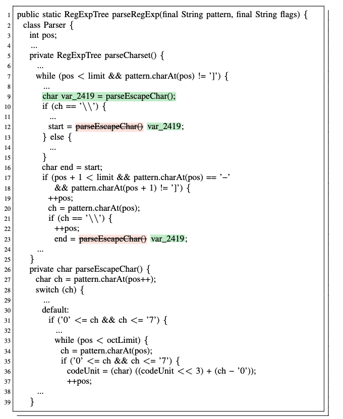

# Example

`Side Effect` refers to such extract variable refactorings where execution of the selected expressions has side effects, i.e., executing multiple times the same expression is not semantically equivalent to a single execution of the same expression. ValExtractor avoided such errors with the validation of selected expressions. A typical example (presented as follows) comes from open-source project Closure.

 

In this case, the selected expression is parseEscapeChar()(on Line 12). The method _parseEscapeChar_ is to retrieve a char from field _pattern_. The position _pos_ points to the character that should be return. It is added by one every time the method is called to return a sequence of characters in turn. 

ValExtractor finds out that the selected expression parseEscapeChar() has side effect because the method body updates _pos_, a field of class. As a result, ValExtractor will not search for any other expressions to be extracted together with the selected expression.

In contrast, Eclipse extracts the expression parseEscapeChar() on both Line 12 and Line 23. It is incorrect because start (Line 12) and end (Line 23) should be assigned with different characters.  