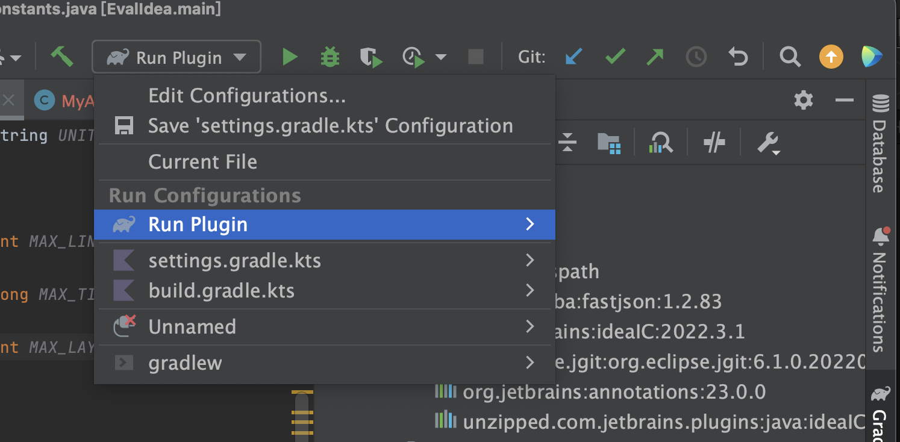
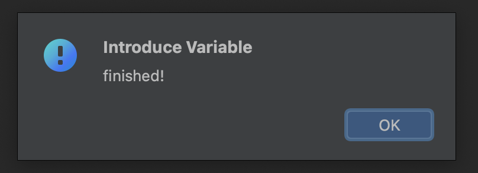

## Replication package for IDEA in Evaluation

# Table of Contents

- [Table of Contents](#table-of-contents)
- [General Introduction](#general-introduction)
- [Requirements](#requirements)
- [How to Replicate IDEA?](#how-to-replicate-idea)
  - [1. Clone replication package to your local file system](#1-clone-replication-package-to-your-local-file-system)
  - [2. Get Subject Applications](#2-get-subject-applications)
  - [3. Import replication package into IntelliJ IDEA](#3-import-replication-package-into-intellij-idea)
  - [4. Configure Path](#4-configure-path)
  - [6. Run Replication Package as Plugin](#6-run-replication-package-as-plugin)
  - [7. Reproduce Evaluation](#7-reproduce-evaluation)
    - [7.1  Import Test Project](#71--import-test-project)
    - [7.2 Run the Plugin](#72-run-the-plugin)
    - [7.3 Outputs of the Replication](#73-outputs-of-the-replication)


# General Introduction

This is the replication package for IDEA in evaluation.


# Requirements
 - Java17
 - Mac OS or Linux
 - IntelliJ IDEA >= 2022.3
  - [Defects4J](https://github.com/rjust/defects4j) 
  
# How to Replicate IDEA?

## 1. Clone replication package to your local file system 

`git clone https://github.com/Anonymous3202/ValExtractor.git`

## 2. Get Subject Applications

`./Implementation/shell/evaluation.sh`

Hint: considering the complexity of defects4j configuration, we provide the zip file of the example project under `evaluation/projects/`.

## 3. Import replication package into IntelliJ IDEA

Click `File` ... `Open`, then select directory(path to **Implementation/idea/EvalIdea**) as root and Click `Open`

Open Gradle perspective and click `Reload All Gradle Projects`


## 4. Configure Path

Open `Constrants.java`(Locate in `exp.utils` package) and modify `Project_Path`( **Path2Implementation/ValExtractor**),  `EXP2_ROOT`(the root path of the generated result in Evaluation part), `Project_NAME` refers to the project you want to test.
```java
//----------- need to configure ----------- 
public static final String Project_Path="***/Implementation/ValExtractor/";
public static final String EXP2_ROOT = "***/EvaluationPaper/";
public static final String Project_NAME = "Lang";
//-----------------------------------------
```	 
Note: please make sure all the paths end with `/`

## 6. Run Replication Package as Plugin
Select `Run Configurations` and run as `Run Plugin`


## 7. Reproduce Evaluation
 
We take project `Lang` as an example to show how to reproduce evaluation. 

### 7.1  Import Test Project
Click `File`|`open`to import `Lang` project.

### 7.2 Run the Plugin
Click `File`|`MyAction`to test `Lang` project.

### 7.3 Outputs of the Replication

After execution, the window will pop up as following.



All the results of idea execution are in `Evaluation/patch/Lang/idea` folders, which are stored in the form of `patch`.
